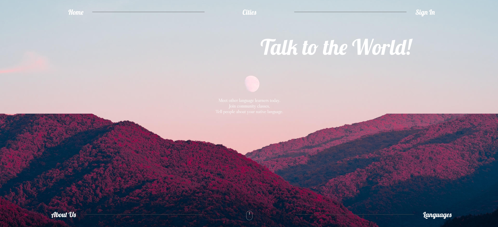

    

## :sunrise_over_mountains: Basic Overview

This is a project to create a website for a company that offers language meetups.

#### :date: Timeframe for the project
The challenge was to create a startup and complete its website within 1 week. (24.02.20-02.03.20)

#### :clapper: Presentation

The complete Website can be viewed [here](https://distracted-leavitt-1e00be.netlify.app). The title image is a short preview of the site.

## :boy: Author

**Tobias Becher**
- GitHub [TB-DevAcc](https://github.com/TB-DevAcc/)
- LinkedIn [Tobias Becher](https://www.linkedin.com/in/tobias-becher-b34341197)
- Hackerrank [TB_DevAcc](https://www.hackerrank.com/TB_DevAcc)

## :pray: Acknowledgments

[CoderSchool](https://www.coderschool.vn/en/) for their help, support & mentorship  
Titlephoto from [NastyaSensei](https://www.pexels.com/@nastyasensei-66707) from Pexels  
Website Main Images from Pexels  
Icons made by Freepik, Monkik, Pongsakornred, dinosoftlabs, pixel-perfect from <a href="https://www.flaticon.com/" title="Flaticon"> www.flaticon.com</a>  

## 📝 License

Copyright © 2020 [Tobias Becher](https://github.com/TB-DevAcc).  
This project is [MIT](https://github.com/kefranabg/readme-md-generator/blob/master/LICENSE) licensed.
